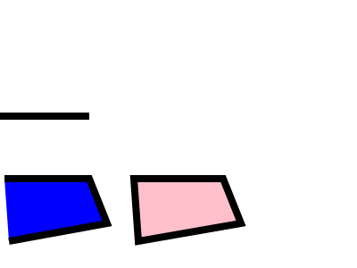

# draw2Svg Manual

## Initialization

### Install and Call
Install with `pip install draw2Svg` on command line, after that import to your project with `import`.
Initiate a drawing instance with `draw.Drawing(WIDTH,HEIGHT)`


```python
import draw2Svg as draw

d = draw.Drawing(400, 300)
```

## Add Basic Drawing
New drawing can be added directyly using `d.draw(ADD_COMMAND_HERE)`, or by creating new drawing first and append it to `draw` instance. Each drawing has basic arguments you need to define it first, but you can always add SVG tags as extra arguments (like fill, stroke, transformation, etc)
```
draw.element(basic_arguments, extras)
```

##### Note on SVG Tags
Normal SVG tags use `kebab-case` for its name, which is forbidden in Python, instead you must rewrite it with `snake_case`. For example to define SVG tag `stroke-width`, you write as `stroke_width`

##### Note on Coordinate system
This library use standard SVG coordinate system which differs from your usual cartesian in `y axis` direction which is inverted. The `y` value increases as we go down, not up. One main reason that this library is forked from original `drawSvg` is coordinate issue.

### Rectangle


```python
#Rectangle initiation Arguments: x, y, width, height
d.draw(draw.Rectangle(
    x=0,y=0,
    width="100%",height="100%",
    fill='#ddd'))

#You can make element first and append it later
box = draw.Rectangle(
    x=20,y=20,
    width=80,height=80,
    fill='pink')
d.append(box)
d
```


    

    


### Line, Lines and Polygon
```
draw.Lines(sx, sy, *points, close=False, **kwargs)
```
sx and sy point to line(s) origin


```python
d = draw.Drawing(400, 300)

# Simple line
p1 = [0,130]
p2 = [100,130]
line1 = draw.Lines(*p1,*p2, stroke="black", stroke_width=8)
d.append(line1)

# The Polyline
p1 = [5,200]
p2 = [100,200]
p3 = [120,250]
p4 = [10,270]
line1 = draw.Lines(*p1,*p2,*p3,*p4, stroke="black", fill= "blue", stroke_width=8)
d.append(line1)

# The Polygon (closed Polyline)
p1 = [150,200]
p2 = [250,200]
p3 = [270,250]
p4 = [155,270]
line1 = draw.Lines(*p1,*p2,*p3,*p4, close="True", stroke="black", fill= "pink", stroke_width=8)
d.append(line1)
d
```


    

    


### Circle
```
draw.Circle(cx, cy, r, **kwargs)
```
cx and cy point to circle's center, r refer to its radius


```python
d = draw.Drawing(400, 300)
circle = draw.Circle(cx=200, cy=150, r=100,  fill= "pink")
d.append(circle)
d
```


    

    


### Ellipse
```
draw.Ellipse(cx, cy, rx, ry, **kwarg)
```
(cx,cy) points to the center and (rx,ry) tells its radius


```python
d = draw.Drawing(400, 300)
ellipse = draw.Ellipse(cx=200, cy=150, rx=150, ry=100,  fill= "cyan")
d.append(ellipse)
d
```


    

    


### Path
To initiate a path, just call this one below. No need to fill any basic argument, but you can always add extras like SVG tags:
```
draw.Path(**kwargs)
```

#### Path datas (actually commands)
W3Schools dan MDN SVG guide has sufficient documentation on Path data

>The `<path>` element is used to define a path.  
>  
The following commands are available for path data:  
>  
M = moveto  
L = lineto  
H = horizontal lineto  
V = vertical lineto  
C = curveto  
S = smooth curveto  
Q = quadratic Bézier curve  
T = smooth quadratic Bézier curveto  
A = elliptical Arc  
Z = closepath  
>
Lowercase commands mean that their movements are relative to current location

In draw2Svg, the commands are represented in form of methods. To use them here, you only need to initiate a path and call the method:


```python
d = draw.Drawing(400, 300)

path = draw.Path(stroke= "pink", fill="None", stroke_width=4)
initPoint = [0,0]
endPoint = [400,0]
ctrlInit = [60,60]
ctrlEnd = [400-60,60]
path.M(*initPoint)
path.C(*ctrlInit, *ctrlEnd, *endPoint)  # Draw a curve to (70, 20)
d.append(path)

path = draw.Path(stroke= "pink", fill="cyan", stroke_width=4)
initPoint = [0,80]
endPoint = [400,80]
ctrlInit = [60,140]
ctrlEnd = [400-60,140]
path.M(*initPoint)
path.C(*ctrlInit, *ctrlEnd, *endPoint)  # Draw a curve to (70, 20)
path.Z() # Close path
d.append(path)
d
```


    

    


### Pie Arc
```
draw.Pie(cx, cy, r, startDeg, endDeg, **kwargs)
```
(cx,cy) point to arc's center, startDeg to its initial angle and endDeg to its final angle


```python
d = draw.Drawing(400, 300)
pie = draw.Pie(cx=200, cy=150, r=100, startDeg=0, endDeg=90, fill= "None", stroke="pink")
d.append(pie)
d
```


    

    


```python

```
